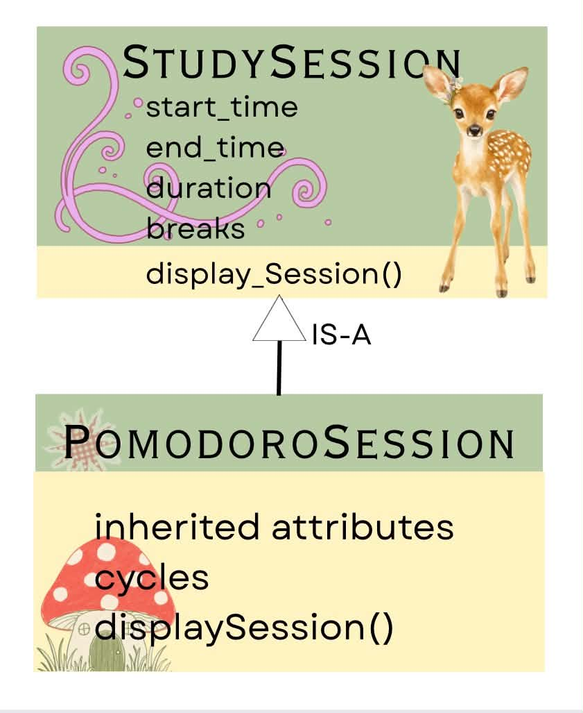
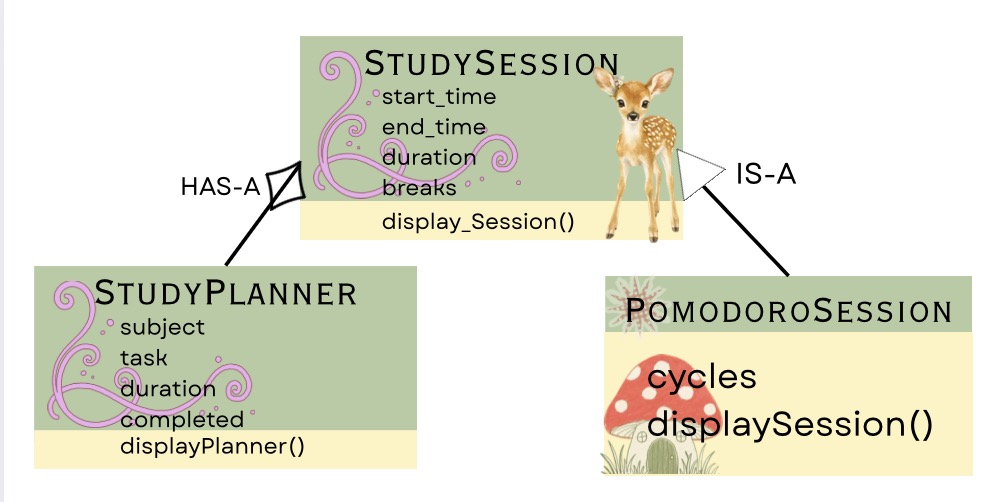
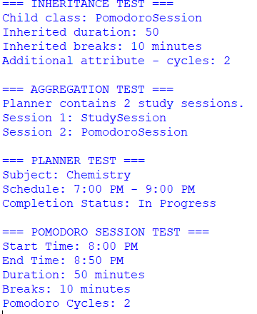
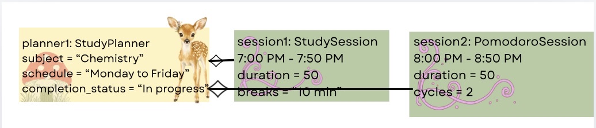

# Advanced Class Relationships

## Previous Activities

[classAttrib](classAttributesMethods.md)
[classRel](classRelationships.md)

## Existing System Description:
The existing system is a study-planning system with two classes, StudyPlanner and StudySession. StudyPlanner represents a student's study plan which includes the subject, schedule, and completion status. The StudySession represents a specific block of time allocated for a subject with start time, end time, duration, and breaks. 

## Inheritance Relationship
Parent: StudySession

Child: PomodoroSession

Explanation: PomodoroSession is a type of StudySession because it  has all basic information of a study session like start time, end time, duration. and breaks. It also has an additional cycles attribute for recording the number of pomodoro cycles. The child class uses super()._init_() to reuse attributes and intialization code from StudySession.

## Inheritance UML

## Composition/Aggregation
Relationship: Aggregation

Class containing another object: StudyPlanner

Contained object: StudySession

Explanation: The relationship is an aggregation because a StudyPlanner can contain StudySession objects but a study session can still exist independently of a planner. In the py implementation, the StudySession object is created first then passed to add_session. This means that the planner does not create or entirely own the session. 

## Advanced UML Diagram

## Python Implementation
[Source Code](advancedRelationships.py)

## Test Run 

## Object Diagram

## Reflection
### 1. Why did you choose your inheritance relationship? Explain why your child class is a type of your parent class.
I chose StudySession as the parent class and PomodoroSession as the child class because a Pomodoro session is a specific type of study session. It still needs the basic information such as start time, end time, duration, and breaks. The PomodoroSession class only adds the number of Pomodoro cycles.

### 2. How did inheritance reduce duplicate code? Identify attributes or methods that were reused.
Inheritance reduced duplicate code because PomodoroSession does not need to rewrite the attributes already found in StudySession. It uses super().__init__() to reuse the parent's initialization code. It also reuses the parent's displaySession() method through super().displaySession().

### 3. Why is your HAS-A relationship Composition or Aggregation? Explain the lifecycle relationship between the two objects.
The relationship is aggregation because StudyPlanner contains StudySession objects, but the sessions can exist independently. The session objects are created separately before they are added to the planner. Therefore, deleting the planner does not necessarily mean that the study session objects must also be deleted.

### 4. What is the difference between Association from Part III and the advanced relationship you implemented?
Association describes a relationship between classes such as a StudyPlanner being connected to a StudySession. Aggregation is more specific because it describes a weak HAS-A relationship where one object contains another object while the contained object can still exist independently. In this system, the planner contains study sessions without completely owning their existence.

### 5. How does your design follow the DRY principle?
The design follows the DRY principle because common study-session attributes and behavior are written only once in StudySession. PomodoroSession inherits those features instead of repeating the same code. This makes the program easier to maintain and update.
