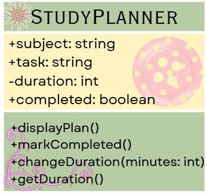
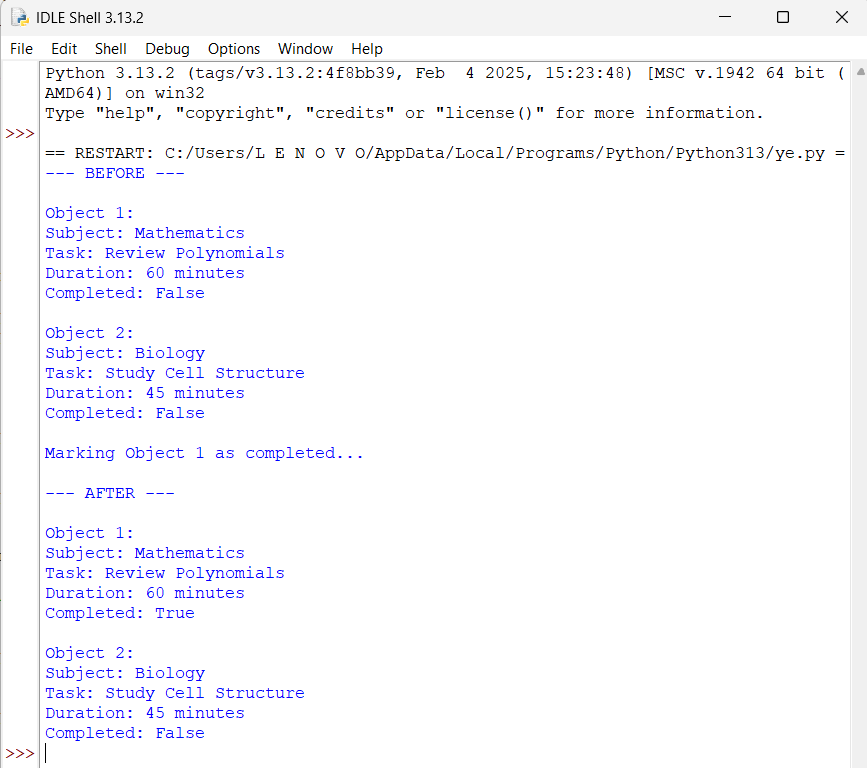
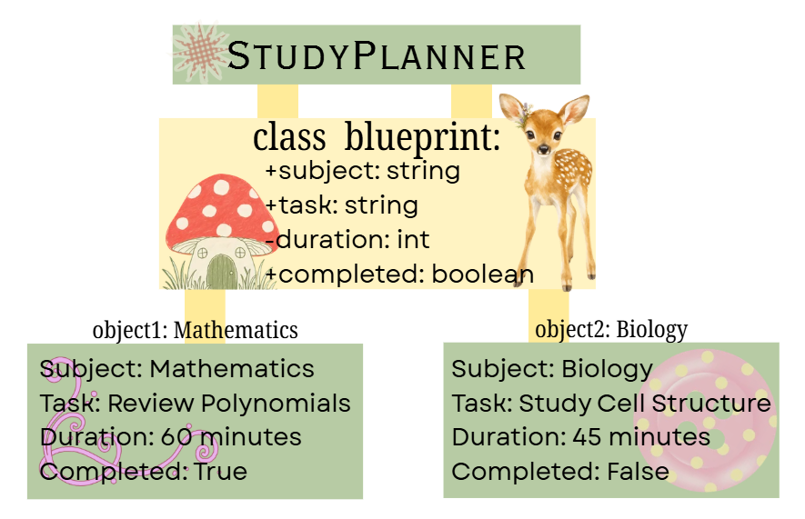

 # Class Attributes and Methods

## Previous Design
Link to my previous activity:
[classObjectUML.md](classObjectUML.md)

## Design Revision
- I kept the StudyPlanner class and its original attributes and methods
- I made duration private because the study time should be controlled and should not be changed into an invalid value
- I added getDuration() so the duration can be safely viewed without directly accessing the private attribute

## Visibility Decisions
| Attribute | Data Type | Visibility | Reason |
|---|---|---|---|
| subject | string | public | it can be accessed normally because the subject is basic information about the study plan |
| task | string | public | |
| duration | int | private | |
| completed | boolean | public | |

## Updated UML Class Diagram
\

## Python Implementation
[View Python Source](classImplementation.py)

## Test Run

## Object Diagram
\

## Analysis

### Why did you make your chosen attribute private?
 I made my chosen attribute private because 

### Which method changes the state of your object?

### How did your two objects demonstrate that instances are independent?

### What is the difference between your class diagram and your object diagram?