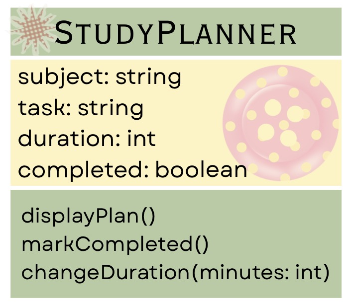

# SG4 - Understanding Classes and Objects

## Class Name
Context: Personal Productivity
Class Name: StudyPlanner

## Class Description
A StudyPlanner represents a personal study plan that helps a student organize a subject, schedule, and completion status for a study task. 

## Properties
| Property | Data Type | Description |
| subject | string | The subject that the student needs to study |
| task | string  | The specific lesson or task to study|
| duration | int | The planned study time in minutes |
| completed | boolean | Indicates whether the study task is finished |

## Methods

| Method | Description |
| displayPlan() | Displays the details of the study plan|
| markCompleted() | Changes the study task's status to be completed|
| changeDuration(minutes: int) | Updates the planned study duration|

## Class Diagram

## Design Explanation
 
### Why did you choose this class?
I chose StudyPlanner because students often have many subjects and school tasks to manage. This class can help organize a study task and keep track of whether it has already been completed.

### Which property is the most important? Why?
I think the task property is the most important because it tells the students exactly what they need to study or accomplish. Without it, the study plan woudld not have a specific purpose.

### Which method is the most useful? Why?
I think markCompleted() is the most useful method because it allows the student to update the study plan after finishing a task. This makes it easier to keep track of completed and unfinished tasks.
