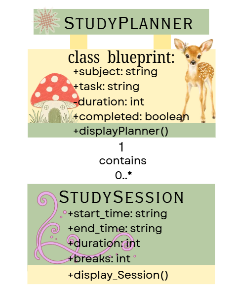
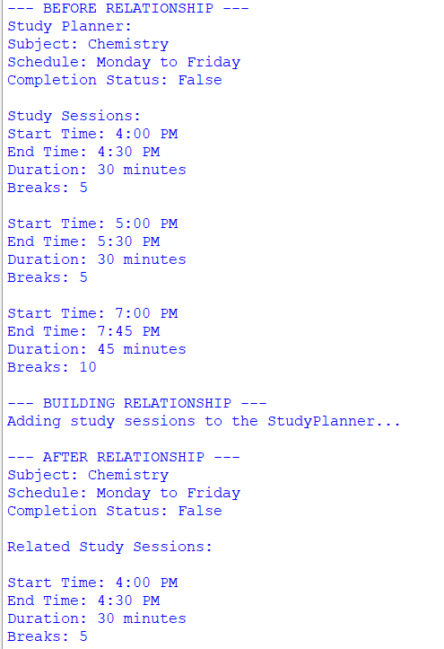
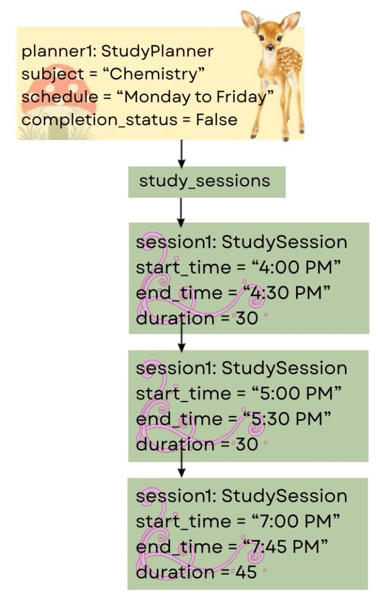

# Class Relationships: Association and Multiplicity

## Previous Work

[Part I - Classes and Objects](classObjectUML.md)

[Part II - Class Attributes and Methods](classAttributesMethods.md)

## Existing Class

Class: StudyPlanner

Description: A StudyPlanner represents a personal study plan that helps a student organize a subject, schedule, and completion status for a study task.

## New Related Class
Class: StudySession 

Description: A StudySession represents a study plan that represents a specific block of time dedicated to studying. It contains attributes like start time, end time, duration, and breaks. It helps students assign different subjects to learn in different time intervals (pomodoro method).

## Association
Relationship: 

Explanation:

## Multiplicity
Multiplicity:

Explanation:

## UML Class Relationship Diagram

## Python Implementation
[View Python Source](classRelationships.py)

## Test Run

## Object Relationship Diagram

## Analysis

### What is the association between your two classes?

### What multiplicity did you choose and why?

### How did you implement the relationship in Python?

### Why did you store an object reference instead of copying its data?

### If your relationship uses many, why is a list appropriate?
